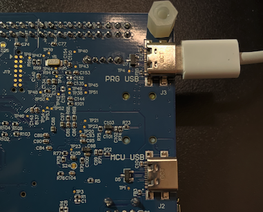

## Move from the FVP to the E8 DevKit

Your FVP run verified the Conformer model, audio preprocessing, inference, and token decoding using recorded audio. You will now use those same ASR stages to recognize speech on the Alif Ensemble E8 DevKit.

The board uses a separate application, `alif_asr`, from the Alif MLEK repository. You will build new firmware for the E8's high-performance Cortex-M55 core, capture audio from its PDM microphones, and read the transcription on the attached display.

| FVP application | E8 DevKit application |
| --- | --- |
| Arm MLEK `asr`, built for Corstone-320 | Alif MLEK `alif_asr`, built for the E8 HP subsystem |
| WAV samples compiled into the firmware | PDM microphone input |
| Simulated UART output in your terminal | Transcription on the attached display |
| Application and model loaded through the AXF file | Application in MRAM and model in external OSPI flash |

## Connect the board and required display

To connect to the Alif Ensemble E8 DevKit:

1. Unplug all USB cables from the DevKit before changing any jumpers.

2. Verify that the jumpers are in their factory default positions, as shown in the Alif Ensemble E8 DevKit (DK-E8) User Guide on [alifsemi.com](https://alifsemi.com/support/kits/ensemble-e8devkit/).

3. Connect a USB-C cable from your computer to the PRG USB port on the bottom edge of the DevKit.



4. Confirm that a green LED illuminates near the E1 device and switch SW4.

{}
Keep a supported display connected throughout the board steps. The `alif_asr` application at the revision used here needs the display attached to run.
{}

<!-- AUTHOR TODO: Confirm the exact display module used for the published test and add a close-up showing the ribbon orientation. Keep the hardware photo specific to the tested E8 DevKit revision. -->

## Install SETOOLS

Secure Enclave Tools (SETOOLS) is Alif's toolset for flashing firmware to MRAM through the Secure Enclave.

1. Download the SETOOLS package for your host operating system from the [Alif Ensemble E8 DevKit support page](https://alifsemi.com/support/kits/ensemble-e8devkit/) and extract it to your home directory, replacing the archive filename in the command:

  ```bash
    cd "$HOME/Downloads"
    tar xvf "replace_with_your_alif_security_toolkit_download.tar" -C "$HOME"
  ```

2. Verify the installation:

  
    
    cd "$HOME/app-release-exec-macos"
    ./app-write-mram -h
    ./app-gen-toc -h
    
  
    cd "$HOME/app-release-exec-linux"
    ./app-write-mram -h
    ./app-gen-toc -h
  
  

  The extracted folder name can vary by SETOOLS release. The commands assume the package extracts to `app-release-exec-*`. Each command should print a `usage:` message. If either command fails, check that you're in the extracted SETOOLS directory for your operating system.

  {}
  On macOS, the system might block the unsigned binary the first time you run it. If this happens, do the following:

  1. Open **System Settings**.
  2. Navigate to **Privacy & Security**.
  3. Select **Open Anyway**, only if you trust the package downloaded from Alif.

  Then, run the command again. You might need to reapprove for both `./app-*` commands.
  {}


## Install J-Link

The SEGGER J-Link Software and Documentation Pack includes J-Flash, which you'll use later to program the model into external OSPI flash.

Install J-Link for your host operating system. This Learning Path was tested with version 9.54. 

On Linux, run `uname -m` and download the matching `.deb` package from the [SEGGER website](https://www.segger.com/downloads/jlink/): x86-64 for `x86_64`, or ARM64 for `aarch64`. Replace the filename in the command:


  
brew install --cask segger-jlink
  
  
cd "$HOME/Downloads"
sudo apt install ./replace_with_your_jlink_download.deb
  


## Clone the Alif MLEK repository

Before you begin, **use Python 3.10–3.13**. Leave any active virtual environment and check your version:

```bash
if type deactivate >/dev/null 2>&1; then deactivate; fi
python3 --version
```

If needed, install a supported version from the [Python downloads page](https://www.python.org/downloads/) and rerun the version check.

Clone Alif MLEK into your home directory.

```bash
cd "$HOME"
git clone https://github.com/alifsemi/alif_ml-embedded-evaluation-kit.git
cd alif_ml-embedded-evaluation-kit
git checkout 0b6ce72c495265501f7a12eaed8e6ea71ef4bf15
git submodule update --init --recursive
```

Use this pinned revision for the first run. If you already have a clone, keep any local work and use a separate directory for a clean test.

## Prepare the ExecuTorch model

Run the resource setup script in the Alif repository:

```bash
python3 set_up_default_resources.py --ml-frameworks executorch
source resources_downloaded/env/bin/activate
```

This prepares the Conformer checkpoint, vocabulary, and Ethos-U85 `.pte` models in the Alif repository layout. It also creates this repository's Python environment. The board build uses these resources when it builds `mlek_alif_asr`.

Confirm the board model and vocabulary are available:

```bash
ls -lh \
  resources_downloaded/asr/conformer_fp32_cln_wer_6_47_arm_delegate_ethos-u85-256.pte \
  resources/asr/labels/librispeech_sp.pieces
```

The generated model used in the tested build is about 10.4 MB. The E8's application MRAM cannot hold that model alongside the firmware, so the build places the model in external flash accessed through the Octal Serial Peripheral Interface (OSPI).

## Locate the board application

The application lives in `source/app/use_case/alif_asr/`. These files explain the parts you will configure and run:

| File | Role |
| --- | --- |
| `usecase.cmake` | Selects the model, vocabulary, activation buffer, and generated assets |
| `src/MainLoop.cc` | Initializes the model, labels, profiler, and application context |
| `src/UseCaseHandlerEt.cc` | Handles microphone capture, preprocessing, ExecuTorch inference, decoding, and display updates |
| `include/UseCaseHandler.hpp` | Declares the use-case handler |
| `alif_asr.json` in the repository root | Describes the MRAM application package and HP boot configuration |

`src/UseCaseHandlerTflm.cc` contains the alternative TensorFlow Lite Micro path. This Learning Path uses `UseCaseHandlerEt.cc`.

## Follow the startup and inference flow

For the ExecuTorch build, `MainLoop.cc` uses `ConformerModel` as the ASR model wrapper. It creates two memory regions before entering the handler: `modelMem` points to the generated model data, and `computeMem` points to the activation buffer used while loading and running the model.

The startup code initializes the model, checks tensor dimensions, loads the vocabulary labels, and creates the profiler. It adds the model, labels, profiler, and Conformer window and hop settings to an application context, then calls `ClassifyAudioHandler(caseContext)`. The context lets helpers share these settings without each owning the full application state.

The handler then:

1. Gets the model tensors and creates the Conformer preprocessor and postprocessor.
2. Initializes the display layout and the button callback.
3. Initializes the PDM microphone path at 16 kHz.
4. Waits for a joystick centre press and captures audio while you hold it.
5. Limits the captured length to fit the model input, generates the Mel spectrogram, runs inference, and decodes the tokens.
6. Updates the display with the transcription and processing times.

The Conformer preprocessing, postprocessing, ExecuTorch model wrapper, and SentencePiece vocabulary serve the same purposes as in the FVP application. The board-specific code supplies live audio, display output, and the E8 memory layout.

## Understand the model and memory settings

The `alif_asr` CMake file enables external flash placement by default:

```cmake
USER_OPTION(${use_case}_MODEL_IN_EXT_FLASH "Run model from external flash"
    ON
    BOOL)
```

With this option enabled, MLEK places model data in the `nn_model_ext_flash` section and generates `ext_flash.bin` separately from `mram.bin`. You will program both files in the next section.

The board configuration uses `TARGET_SUBSYSTEM=RTSS-HP`, `TARGET_BOARD=DevKit-e8`, and `TARGET_MICS=PDM`. Its ExecuTorch memory pools are:

- `alif_asr_ACTIVATION_BUF_SZ=0x00108000` for the method allocator pool.
- `ML_FWK_TMP_MEM_SIZE=0x002C0000` for temporary allocation.

Keep these settings for the first run so that model selection, runtime memory, and the physical connections match the tested application.

## What you have accomplished and what is next

You have connected the required board hardware, prepared the Alif MLEK resources, and identified how the board application extends the ASR flow you ran on the FVP.

Next, you will build the E8 firmware, program the model into OSPI flash, and install the application in MRAM.
