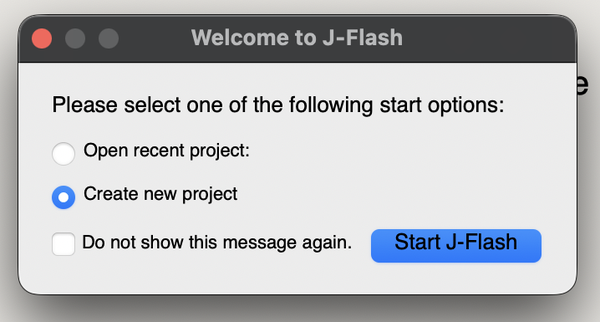
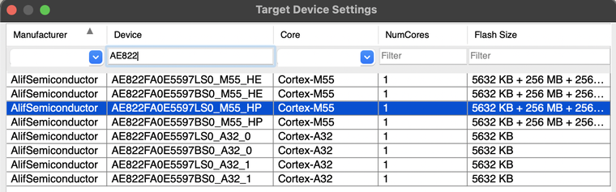
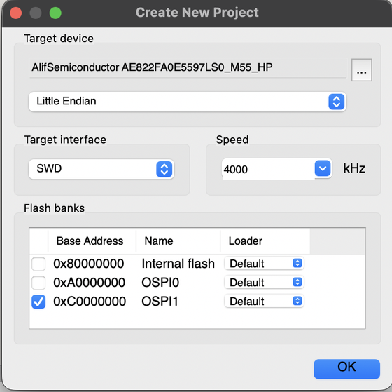
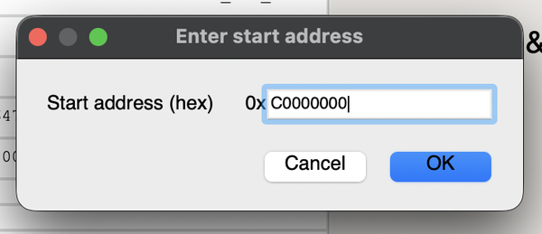
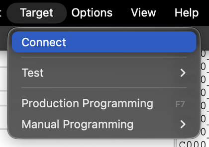
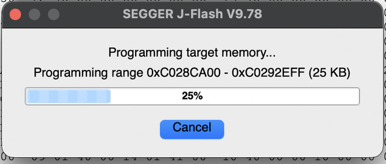
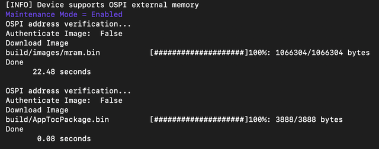

## Build the E8 application

This build captures PDM microphone input and shows the transcription on the attached display.

Activate the Python environment created by the setup script:

```bash
export ALIF_MLEK_ROOT="$PWD"
source resources_downloaded/env/bin/activate
```

Configure the firmware from the repository root:

```bash
cmake -S . -B build_alif_asr \
  -DTARGET_PLATFORM=alif \
  -DUSE_CASE_BUILD=alif_asr \
  -DTARGET_SUBSYSTEM=RTSS-HP \
  -DTARGET_BOARD=DevKit-e8 \
  -DML_FRAMEWORK=ExecuTorch \
  -DML_FWK_TMP_MEM_SIZE=0x002C0000 \
  -DGLCD_UI=OFF \
  -DETHOS_U_NPU_ID=U85 \
  -DCONSOLE_UART=4 \
  -DTARGET_MICS=PDM
```

`RTSS-HP` selects the high-performance Cortex-M55 subsystem. `alif_asr` selects the Conformer model and vocabulary.

{}
Keep `GLCD_UI=OFF` as shown. It disables the generic MLEK GLCD interface to save memory; this application still uses its own LVGL display interface. The display remains required.
{}

Build the ASR target:

```bash
cmake --build build_alif_asr --target mlek_alif_asr --parallel 4
```

Confirm that the build generated the executable and both programming images:

```bash
ls -lh \
  build_alif_asr/bin/sectors/alif_asr/ext_flash.bin \
  build_alif_asr/bin/sectors/alif_asr/mram.bin
```

`ext_flash.bin` contains the model data for external OSPI flash. `mram.bin` contains the application firmware. Use these two images from the same build.

## Confirm the E8 device and configure SETOOLS

The firmware you just built targets the E8 DevKit's M55-HP core and Ethos-U85 NPU. Before programming, confirm the connected chip's full part number and silicon revision so the programming tools match your hardware.

Set `SETOOLS_ROOT` to your extracted Security Toolkit directory. Edit the path in the appropriate tab if your installation is elsewhere:


  
export SETOOLS_ROOT="$HOME/app-release-exec-linux"
  
  
export SETOOLS_ROOT="$HOME/app-release-exec-macos"
  


Close any serial terminal that is using the board. Set **SW4** to **SE**, connect **PRG USB**, and press and release **RESET**.

Find the board's serial device. Compare the list with the board disconnected and connected if you have several devices:


  
ls -l /dev/ttyACM* /dev/ttyUSB* 2>/dev/null
export ALIF_PORT=/dev/ttyACM0
  
  
ls /dev/cu.usb* 2>/dev/null
export ALIF_PORT=/dev/cu.usbmodemXXXX
  


Replace the example `ALIF_PORT` with the device you found. On Linux, your user must have permission to open it. If the device belongs to `dialout`, add your user to that group with `sudo usermod -aG dialout "$USER"`, then sign out and back in before continuing. After signing back in, repeat the `ALIF_MLEK_ROOT`, `SETOOLS_ROOT`, and `ALIF_PORT` assignments above; these variables do not survive closing the shell.

Open the read-only device information menu:

```bash
cd "$SETOOLS_ROOT"
./maintenance -c "$ALIF_PORT"
```

{}
Again, for macOS, the system might block ./maintenance the first time you run it. If this happens, do the following:

1. Open **System Settings**.
2. Navigate to **Privacy & Security**.
3. Select **Open Anyway**.

Then, run the command again.
{}

Select **2 - Device Information**, then **5 - Get revision info**. Record the full part number (`ALIF_PN`) and silicon revision. Press **Enter** to return through the menus and exit.

Run `tools-config` and confirm that the selected part number and silicon revision match the detected device.

```bash
./tools-config
```

If these settings already match, leave them unchanged. If the toolkit does not support the detected part or revision, use a compatible toolkit before proceeding. Do not continue through a part or revision mismatch without resolving it.

## Install the temporary CPU stubs

The programming sequence is: install CPU stubs in MRAM, program OSPI, then replace the stubs with the ASR application. The stubs keep the existing application from using peripherals while J-Flash runs its external-flash programming algorithm. This preparation follows the [Alif MLEK OSPI programming guide](https://github.com/alifsemi/alif_ml-embedded-evaluation-kit/blob/0b6ce72c495265501f7a12eaed8e6ea71ef4bf15/docs/programming_flash_jlink.md).

From the SETOOLS directory, generate and write the stub package:

```bash
cd "$SETOOLS_ROOT" && \
./app-gen-toc -f build/config/app-cpu-stubs.json && \
./app-write-mram -c "$ALIF_PORT" -p
```

The `&&` operators prevent the write if package generation fails. Continue only after both commands succeed and the write reaches 100% followed by `Done`. The `-c` option selects the serial port; `-p` pads the images to a 16-byte boundary.

Press and release **RESET** so the stubs boot.

## Program external OSPI flash with J-Flash

Keep the **PRG USB** cable connected after installing and resetting the CPU stubs. Close any SETOOLS session or serial terminal that is using the board. The onboard J-Link uses this same cable; a second debugger cable is not needed.

The steps follow the [Alif MLEK J-Flash guide](https://github.com/alifsemi/alif_ml-embedded-evaluation-kit/blob/0b6ce72c495265501f7a12eaed8e6ea71ef4bf15/docs/programming_flash_jlink.md#j-flash-project). The screenshots below show J-Flash V9.78 on macOS.

1. Open **J-Flash**, select **Create new project**, then select **Start J-Flash**.

   

2. Open the **Target device** selector. For the tested part `AE822FA0E5597LS0`, select `AE822FA0E5597LS0_M55_HP`. If your detected part differs, confirm the appropriate supported target before proceeding. Don’t select this entry simply because it appears in the example.

   

3. Set the target interface to **SWD** and the interface speed to **4000 kHz**.

4. Enable only the external OSPI flash bank starting at `0xC0000000`. Disable the MRAM banks, then select **OK** to create the project.

   

5. Select **File > Open data file** and open `build_alif_asr/bin/sectors/alif_asr/ext_flash.bin`. You can also drag the file into J-Flash. When prompted for the start address, enter `0xC0000000`.

   

6. Ensure your USB-C cable is still connected and select **Target > Connect**. Check that the log reports a successful connection before continuing.

   

7. Select **Target > Production Programming**. J-Flash erases the affected OSPI sectors, writes the model, and verifies the programmed data. Wait for the log to confirm successful programming and verification before continuing.

   

8. Select **Target > Disconnect** and close J-Flash.

{}
If J-Link connects but reports `Failed to perform RAMCode-sided Prepare()`, check the selected device and flash bank, confirm the CPU-stub write succeeded, and reset the board before retrying. Sometimes, it might help to pwercycle the board and reopen JFlash. This message is not a successful OSPI write.
{}

## Package and flash the ASR application into MRAM

Copy the application configuration and freshly built MRAM image into the toolkit:

```bash
cp "$ALIF_MLEK_ROOT/alif_asr.json" "$SETOOLS_ROOT/build/config/alif_asr.json" 
cp "$ALIF_MLEK_ROOT/build_alif_asr/bin/sectors/alif_asr/mram.bin" "$SETOOLS_ROOT/build/images/mram.bin"
```

The configuration identifies the HP boot application and includes the board device configuration:

```output
{
    "HP_asr": {
        "binary": "mram.bin",
        "version": "1.0.0",
        "mramAddress": "0x80008000",
        "cpu_id": "M55_HP",
        "flags": ["boot"],
        "signed": false
    },
    "DEVICE": {
        "disabled": false,
        "binary": "app-device-config.json",
        "version": "0.5.00",
        "signed": true
    }
}
```

The `DEVICE` entry references `app-device-config.json`, supplied with SETOOLS at `$SETOOLS_ROOT/build/config/app-device-config.json`. The toolkit includes this device configuration in the application package; you do not need to create it in the MLEK repository.

After both files copy successfully, generate a new application table of contents (ATOC) from `alif_asr.json` and write the application:

```bash
cd "$SETOOLS_ROOT"
./app-gen-toc -f build/config/alif_asr.json
./app-write-mram -c "$ALIF_PORT" -p
```

Check that the write names `build/images/mram.bin` and `build/AppTocPackage.bin`, and completes successfully. 



## Check programming problems

| Symptom | Check |
| --- | --- |
| SETOOLS opens the serial port but reports `Target did not respond` | Close other serial programs, select SW4 **SE**, reset the board, and retry with the current port |
| A part or revision mismatch appears | Select the detected device in `tools-config`, regenerate the package, and retry |
| J-Flash cannot connect to the probe | Check PRG USB, close other debugger programs, and return USB access to the J-Flash host if using WSL |
| J-Flash cannot prepare the OSPI flash algorithm | Check the part, OSPI bank, and that the CPU stubs were written and booted |
| The board still boots a previous application | Check the copied `mram.bin` and regenerate the package with `alif_asr.json` before writing again |

## What you have accomplished and what is next

You have built the E8 firmware, programmed the model into external OSPI flash, and replaced the temporary CPU stubs with the ASR application in MRAM.

Next, you will reset the board, test a spoken phrase, and read the transcription on the display.
