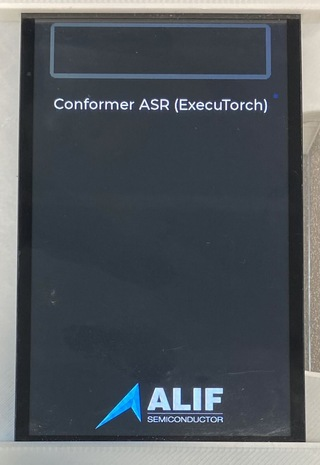
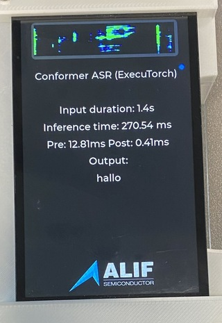

## Start the application

Keep the supported display attached and the **PRG USB** cable connected.

Close J-Flash and SETOOLS, then press and release **RESET**. Wait for the display to show **Conformer ASR (ExecuTorch)** before testing audio.

## Speak a short phrase

Locate the joystick shown in Figure 2A (page 8) of the [E8 DevKit User Guide](https://alifsemi.com/download/AUGD0023#page=8).

1. Press straight down on the centre of the joystick and hold it.
2. Say a short phrase while holding it.
3. Release the joystick to finish recording.
4. Wait for the transcription to appear on the display.

The display also shows the spectrogram, input duration, and processing times. The exact transcription depends on your speech and background noise. Repeat with a different phrase to check that another recording works.

## If the test does not work

- **Blank display:** power off before checking the display ribbon cable. Confirm that both images were programmed successfully and that the final MRAM write used the ASR package, not the CPU stubs.
- **Empty or incorrect transcription:** keep the microphones unobstructed, hold the joystick centre throughout the phrase, and try again in a quiet setting.

## What you have accomplished

You have programmed the E8 DevKit, captured live speech, and read the Conformer ASR transcription on its display.
