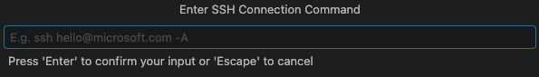
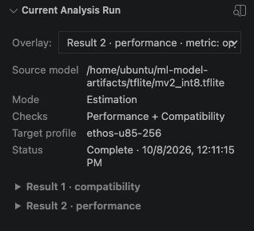
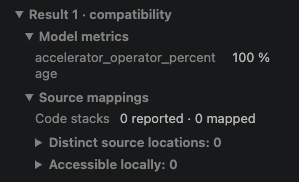
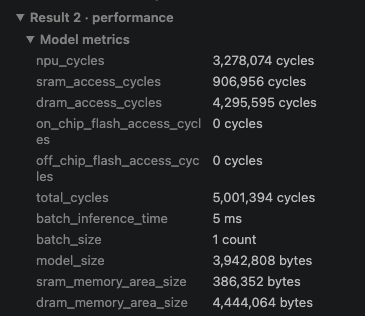
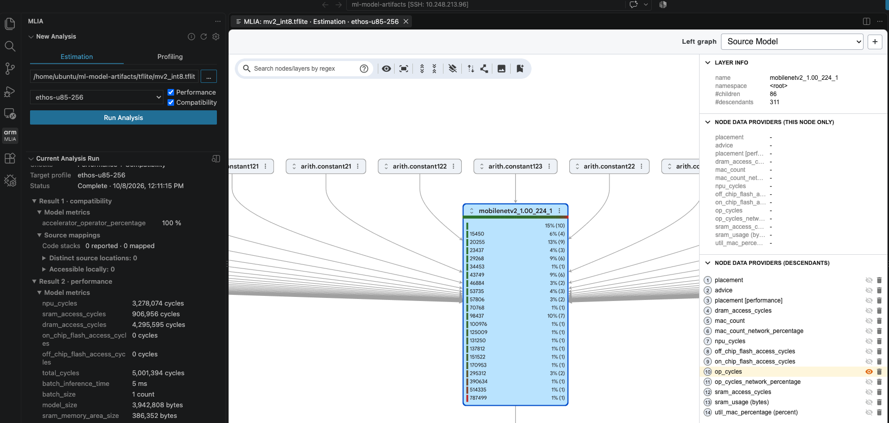
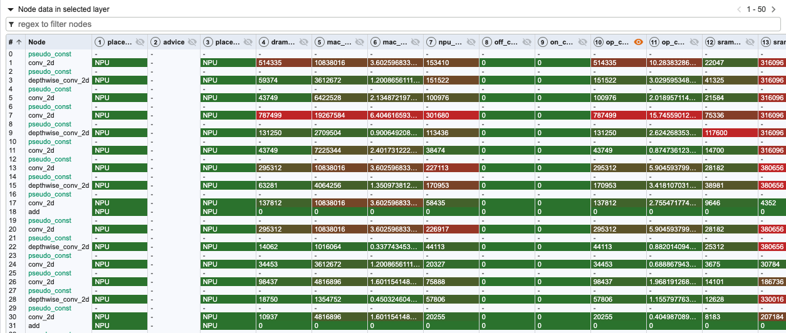
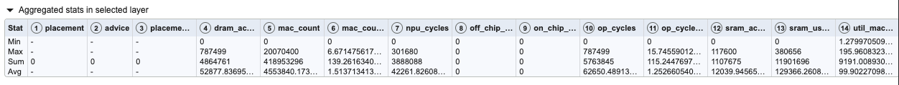
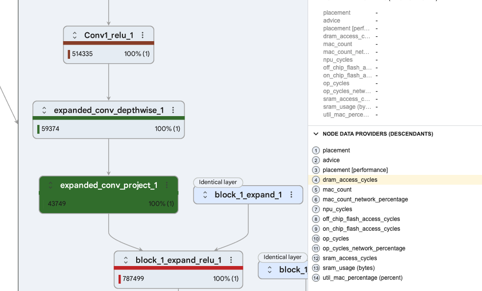
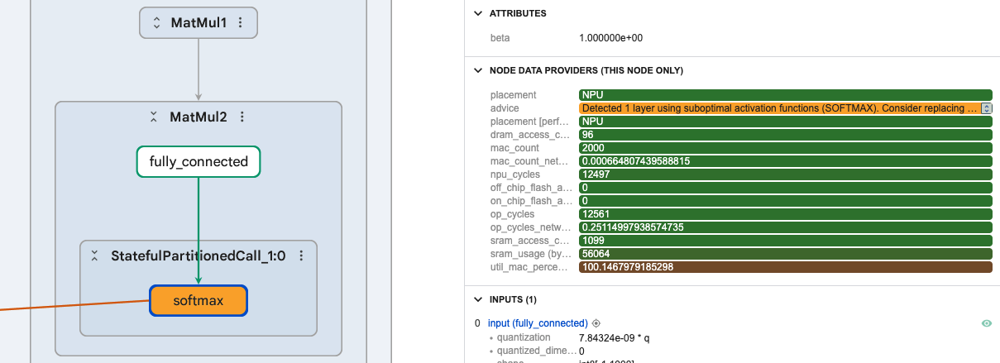

The MLIA VS Code extension allows you to move from a CLI view, to using MLIA within your IDE, and also supports visualizing models in Model Explorer, with data from MLIA overlaid onto the model graphs.

## Open your model workspace in VS Code

Ensure you have [VS Code](https://code.visualstudio.com/download?_exp_download=d53503e735) 1.100 or newer on your local machine.

If you completed the earlier steps on that same local machine, open VS Code, select **File > Open Folder**, open your `ml-model-artifacts` directory, and continue to **Install the MLIA extension and prepare its environment**.

If you completed the earlier steps on a remote Linux machine, connect to it using [VS Code Remote - SSH](https://code.visualstudio.com/docs/remote/ssh). Use the same SSH connection details you used for the CLI steps:

1. Install the **Remote - SSH** extension on the machine running VS Code.
2. Open the Command Palette with **Ctrl+Shift+P** on Windows or Linux, or **Cmd+Shift+P** on macOS. Select **Remote-SSH: Add New SSH Host**.
3. Enter your existing SSH command, including any key-file option such as `-i`. For example, enter `ssh ubuntu@YOUR_HOST`, replacing the user and host with your connection details. Select an SSH configuration file when prompted.

4. Run **Remote-SSH: Connect to Host** and select the host you added.
5. Confirm that the VS Code status bar shows your SSH host.
6. In the connected window, select **File > Open Folder** and open the remote `ml-model-artifacts` directory.

With Remote - SSH, the MLIA extension and analysis run on the remote host.

## Install the MLIA extension and prepare its environment

Open the **Extensions** view, search for **MLIA**, and install the extension published by **Arm**. If you are connected over SSH, install MLIA on the SSH host and confirm that it is enabled there, as shown below.

MLIA installed on the remote host

Select **MLIA** in the Activity Bar. In **New Analysis**, select **Refresh MLIA Environment** and wait for setup to finish.

Create the managed MLIA environment

The extension installs and manages `uv`, Python, and MLIA in its own environment. You don't need to activate `mlia_env` or install MLIA again for the extension. Its packages and backends are separate from the CLI environment you created earlier.

Setup is complete when **New Analysis** shows the **Estimation** and **Profiling** tabs, a source-model field, and target-profile selection.

Analysis options after environment setup

## Run an Ethos-U estimation for a TFLite model

In **New Analysis**:

1. Select **Estimation**.
2. Use the **...** button next to **Source model** to select `tflite/mv2_int8.tflite` in your model-artifacts folder.
3. Select **ethos-u85-256** as the target profile.
4. Enable both **Performance** and **Compatibility**, by ticking each box.
5. Select **Run Analysis**.

Select the model, target, and checks

Model Explorer opens with a loading view while the analysis runs. When it finishes, **Current Analysis Run** shows **Complete**, the model path, target profile, and selected checks. The completed-run screenshot confirms **Performance + Compatibility**.

## Inspect compatibility and model performance

Expand **Result 1 · compatibility > Model metrics**. For this INT8 model, expect `accelerator_operator_percentage` to be **100%**, matching the earlier CLI check.

Expand **Result 2 · performance > Model metrics** to inspect model-level cycle estimates, memory use, and estimated inference time.

These LiteRT results come from Vela compiler estimates. The displayed inference time is an estimate, rather than latency measured on a board.

## Explore operation metrics in Model Explorer

In Model Explorer, pan, zoom, and expand the model's groups to inspect operations. Use the search box to locate a node by name.

Select a performance metric in the **Overlay** selector under **Current Analysis Run**. The corresponding values and colours appear on the graph. You can also select this in Model Explorer, and this is synchronized with the sidebar. `op_cycles` are shown in the image below.

Select a model group and inspect **Node data in selected layer**. Compare operation placement, `npu_cycles`, `op_cycles`, and memory-access metrics. Use the table's filter to narrow the operations you inspect.

The **Aggregated stats in selected layer** table summarizes the available numeric metrics with minimum, maximum, sum, and average values. These summaries describe the selected graph group; use **Model metrics** for the whole-model result.

You can zoom in on the graph to see specific operators, with associated data overlaid. For example, to investigate memory cost, select the `dram_access_cycles` overlay. Expand a group and compare the values attached to its operations.

## Find advice on the model graph

Select **advice** as the overlay in **Current Analysis Run** or Model Explorer to highlight operations with MLIA advice. Select a highlighted operation to inspect its advice.

The advice identifies `SOFTMAX` as a suboptimal activation for NPU performance. The operation is supported, so the model can still map fully to the NPU, but it is a candidate for optimization. You could choose to change the model, after which you can rerun MLIA to compare compatibility and performance estimates, and check that prediction accuracy and any required probability outputs still meet your application's needs.

## What you've accomplished

You've set up the MLIA extension, analyzed a model for Ethos-U, and inspected compatibility, model metrics, operation overlays, and advice in Model Explorer. You can now use the same workflow to compare other supported model artifacts or investigate a revised model.
