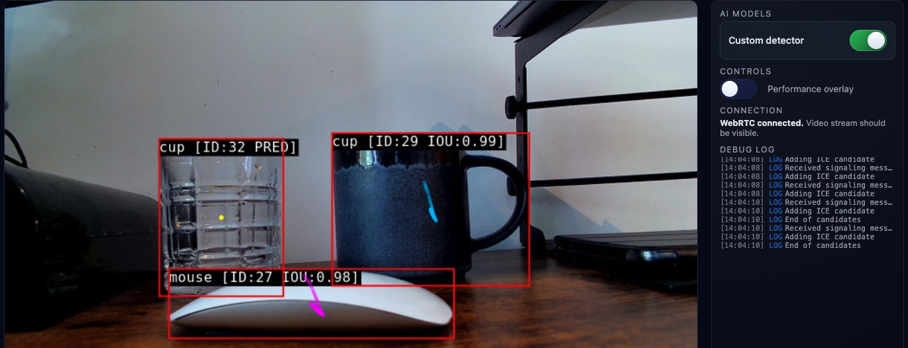

## Build a custom pipeline with a new model (YOLOv8n)

The demo we previously ran demonstrates use of some default models, provided in the kit, to perform inference on preset data sources. We will create our own custom pipeline using a camera input and a new model. First we will add the new model.

In this example, we are going to use YOLOv8n. By using YOLOv8n, we are able to reuse a pre-provided `YoloParser.cpp` parser, used already for other YOLO variants. The logical extension of this is building a custom parser for other models, but this is out of scope in this learning path. For more detail on the available default parsers, please look at the [Bring Your Own Model Documentation](https://github.com/Arm-Debug/amp-dev-forge/blob/main/docs/public/how-to/deep-dives/bring-your-model.md).

The commands below create a new python environment for exporting the model to `.onnx` format. The Arm Perception Pipeline Kit uses a model directory that includes a model file, a `model.json`, and an `opchain.json`. The commands create a new model directory called `custom-detector`. At the end, the new venv is deactivated and we return to the default venv (created when the container was built).

Run these commands from `/work` inside the container shell.

```bash
sudo apt update
sudo apt install -y python3-venv python3-pip

python3 -m venv .venv-yolo
source .venv-yolo/bin/activate

python -m pip install --upgrade pip
python -m pip install ultralytics onnx onnxsim

mkdir -p /work/config/models/custom-detector

yolo export model=yolov8n.pt format=onnx imgsz=640 opset=13 simplify=True
mv -f yolov8n.onnx /work/config/models/custom-detector/yolov8n.onnx
ls -lh /work/config/models/custom-detector/yolov8n.onnx

deactivate
source /work/tools/.venv/bin/activate
```

## Create model.json

Create `/work/config/models/custom-detector/model.json` using the command below, defining your model metadata. The values below match a standard YOLOv8n ONNX export at `imgsz=640`.

```bash
cat > /work/config/models/custom-detector/model.json <<'EOF'
{
	"name": "custom-detector",
	"modelFamily": "yolo-obj",
	"modelFile": "yolov8n.onnx",
	"dynamicOutput": true,
	"maxDetectionCount": 100,
	"confidenceThreshold": 0.4,
	"iouThreshold": 0.45,
	"inputTensors": [
		{
			"shape": [1, 3, 640, 640],
			"dataKind": "ImageRgbChw"
		}
	]
}
EOF
```

Use this quick reference to understand each field, what the value means, and where it is used.

- `modelFamily: "yolo-obj"` declares the model family as YOLO object detection in model metadata.
- `dynamicOutput: true` is a model/runtime setting for handling dynamic output tensor shapes.
- `maxDetectionCount: 100` is an optional model metadata value. Detection count limits used by `YoloParser` are set in `opchain.json` (for example, `maxDetections`).
- `confidenceThreshold: 0.4` is an optional model metadata value. The threshold used by `YoloParser` is set in `opchain.json` under `GenericPostprocess` attributes.
- `iouThreshold: 0.45` is an optional model metadata value. The IoU threshold used by `YoloParser` is set in `opchain.json` under `GenericPostprocess` attributes.
- `modelFile: "yolov8n.onnx"` is the model artifact file name used by inference.
- `inputTensors.shape: [1, 3, 640, 640]` is the expected input tensor dimensions.
- `dataKind: "ImageRgbChw"` is the expected image layout and channel order (RGB, channels-first).

For this YOLOv8n example, [1, 3, 640, 640] with RGB CHW preprocessing is the expected default from Ultralytics ONNX export at `imgsz=640`, but your exported ONNX file is always the source of truth.

If you export with a different image size, update `inputTensors.shape` to match exactly.

You can get the expected shape by inspecting the ONNX input tensor quickly with Python:

```bash
source .venv-yolo/bin/activate
python - <<'PY'
import onnx
m = onnx.load('/work/config/models/custom-detector/yolov8n.onnx')
dims = [d.dim_value for d in m.graph.input[0].type.tensor_type.shape.dim]
print('input shape:', dims)
PY
deactivate
source /work/tools/.venv/bin/activate
```

## Create opchain.json

Use the following command to create `/work/config/models/custom-detector/opchain.json` to define preprocess, inference backend, and postprocess operations:

```bash
cat > /work/config/models/custom-detector/opchain.json <<'EOF'
{
	"name": "Custom detector",
	"description": "Custom YOLOv8n ONNX detector opchain.",
	"ops": [
		{
			"id": "amp-std-ops/InferenceController",
			"attributes": {}
		},
		{
			"id": "amp-std-ops/GenericImagePreprocess",
			"attributes": {
				"inputImageTensorIndex": 0,
				"inputImageSourceName": "pipelineVideoFrame"
			}
		},
		{
			"id": "amp-onnx-ops/Inference",
			"attributes": {
				"modelDescriptor": "/work/config/models/custom-detector/model.json"
			}
		},
		{
			"id": "amp-std-ops/GenericPostprocess",
			"attributes": {
				"parser": "YoloParser",
				"normalizeOutputCoordinates": false,
				"applyNms": true,
				"confidenceThreshold": 0.4,
				"iouThreshold": 0.45
			}
		}
	]
}
EOF
```

This opchain has four stages. Keeping the order is important:

- `InferenceController` coordinates operation flow. No attributes are needed.
- `GenericImagePreprocess` takes the live frame (`pipelineVideoFrame`) and formats it to the model input tensor.
- `amp-onnx-ops/Inference` runs ONNX Runtime with your `model.json` descriptor. In the optional step to use Hailo, we will change this to use HailoRT instead of ONNX.
- `GenericPostprocess` with `YoloParser` decodes YOLO outputs into detections for downstream elements.

For parser behavior, `GenericPostprocess` in `opchain.json` is the source of truth.

- `confidenceThreshold: 0.4` and `iouThreshold: 0.45` are applied during parsing/NMS.
- `applyNms: true` enables NMS (non-maximum suppression), which removes overlapping duplicate bounding boxes and keeps the highest-confidence result.
- `normalizeOutputCoordinates: false` controls how output coordinates are interpreted for this parser path.

You will have seen similarly named values in `model.json`. In this workflow, treat `model.json` as model/runtime metadata and `GenericPostprocess` attributes as parser tuning.

## Add and run a custom pipeline entry

Use the following command to create a new pipeline file at `/work/config/pipelines/05-custom-detector.json`. 

{}
Remember to change `/dev/video0` to match your specific camera device, checkable with 
```bash
v4l2-ctl --list-devices
```
{}

```bash
cat > /work/config/pipelines/05-custom-detector.json <<'EOF'
{
	"description": "Custom YOLOv8n ONNX detector with camera input and on-screen output.",
	"pipeline": [
		"v4l2src device=/dev/video0 !",
		"videoconvert ! video/x-raw,format=BGRA !",
		"ampinfer opchain-path=/work/config/models/custom-detector/opchain.json active=true !",
		"amptracker content-type=genericObject !",
		"amposd enabled=true !",
		"ampsink name=sink"
	]
}
EOF
```

Pipeline stage summary:

- `v4l2src` captures camera frames from `/dev/video0`.
- `videoconvert` and `video/x-raw,format=BGRA` ensure a stable video format before inference.
- `ampinfer` attaches your custom opchain created above.
- `amptracker` stabilizes detections over time.
- `amposd` overlays boxes/labels on the output stream.
- `ampsink` sends output to the kit display path.

Once you have saved your pipeline, you can now run inference in the terminal, or using the Command Palette as before. The terminal command is given below:

```bash
./tools/amp-menu 05-custom-detector
```

Navigate to `http://localhost:9999` and you should now see your model (custom detector) as the only AI model option, and object detection being performed in the overlay.



## What changes for a different model?

These settings are usually model-agnostic and stay similar across models:

- `InferenceController` and `amp-onnx-ops/Inference` opchain stages
- Camera source and display stages in the pipeline (`v4l2src`, `videoconvert`, `amposd`, `ampsink`)
- `modelDescriptor` path wiring between `opchain.json` and `model.json`

For a different model family, confirm the following before you run the pipeline:

- Exact input tensor shape, layout, and color format expected by the ONNX model
- Output tensor format and whether a built-in parser supports it
- Whether NMS is needed, and which parser attributes are relevant in `GenericPostprocess`
- Correct `modelFamily` value in `model.json` for the parser path you are using
- Whether tracker content type matches parser output type

If no built-in parser matches your output tensors, you need a custom parser: [Custom Postprocessing Documentation](https://github.com/Arm-Debug/amp-dev-forge/blob/main/docs/public/how-to/deep-dives/custom-postprocessing.md)

## (Optional) Change the input source and other pipeline changes

You can keep inference and sink stages in your custom pipeline unchanged and replace only the source lines.

For USB camera input:

```json
"v4l2src device=/dev/video0 !",
"videoconvert ! video/x-raw,format=BGRA !",
```

For pre-recorded video input:

```json
"filesrc location=/work/data/videos/01.mp4 !",
"decodebin !",
"videoconvert ! video/x-raw,format=BGRA !",
```

For image input:

```json
"filesrc location=/work/data/images/katana.jpg !",
"jpegdec !",
"imagefreeze !",
"videoconvert ! video/x-raw,format=BGRA !",
```

Other changes you may want to try are:

- Overlay changes: disable `amposd` when you only need inference results and want less render overhead.
- Tracker changes: disable `amptracker` for per-frame raw detections, or keep it for steadier object IDs.
- Multiple models in the same pipeline. This custom pipeline uses one model (`ampinfer` appears once). The demo pipeline in `/work/config/pipelines/01-full-onnx.json` shows how to run multiple models in one pipeline by chaining several `ampinfer` elements one after another before `amptracker`.

## What you've learned and what's next

You now have a reusable pattern for integrating your own ONNX model into a Perception Kit GStreamer pipeline on Arm. Next, you will switch to a pipeline that uses `ampcomm` and `fakesink`, and build a local FastAPI dashboard that launches the pipeline and consumes inference events.

Optionally, you can first explore repeating your custom pipeline, but for Hailo rather than on CPU.
