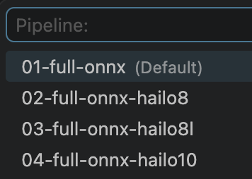
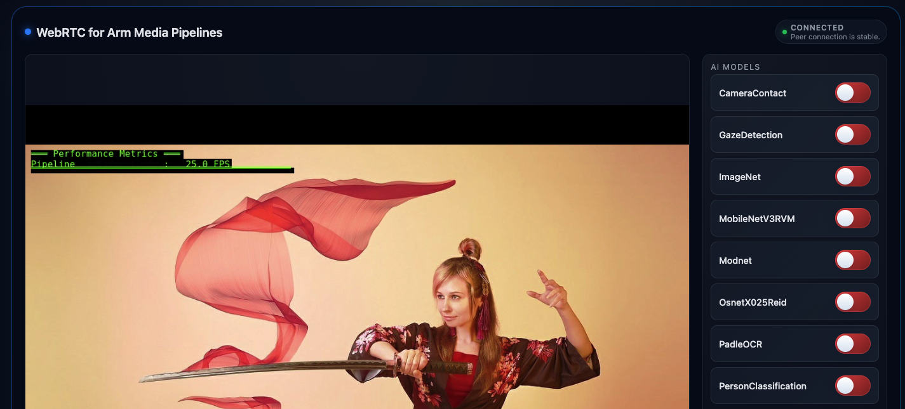

## What you will build

This Learning Path shows you how to move from demo pipelines in the Arm Perception Pipeline Kit to a custom vision AI inference pipeline, integrated with a basic Python application. The workflow is short and practical so you can quickly adapt it to your own data source, model, and output requirements on Arm-based edge devices.

The benefit of the kit is that it supports multiple runtimes, and can work across both CPU, and Hailo accelerators. There are many application use-cases for which a perception inference pipeline is required. 

For example:

- AI-enabled Network Video Recorders performing occupancy detection, facial recognition, numberplate recognition, and more
- Live written text transcription
- Robotics requiring perception and object detection

With the Arm Perception Pipeline Kit, the inference pipeline is handled for you - requiring just a simple stringing together of pipeline stages in a repeatable template, with minimal changes across models. You are then free to build an application around this pipeline.

In this learning path, you will build a custom pipeline JSON that links together:

- A video source and color conversion stage in GStreamer.
- An `ampinfer` element that points to your model opchain.
- Optional tracking and overlay elements.
- A sink to display or route inference output.

You will run your custom pipeline with `amp-menu` and verify that inference starts correctly.

You will then create a simple Python application that leverages your pipeline.

This learning path will focus on CPU inference on the Raspberry Pi 5, with optional extension to move inference onto an AI Hat accelerator. Much of the process is also transferable across other Linux, WSL, or macOS devices.

## Validate using a demo pipeline

Before starting this Learning Path, you should have installed and set up the Perception Pipeline Kit using the [Install Guide](https://learn.arm.com/install-guides/perception-kit/). You should have VS Code running on a development machine, connected via the Remote SSH extension to your Raspberry Pi 5, with the `amp-dev-forge` directory open.

We will briefly repeat the final steps of the install guide to validate that your setup is correct.

Use `Cmd + Shift + P` or `Ctrl + Shift + P` to open the Command Palette, depending on macOS vs Linux/WSL on your development machine.

Run `Dev Containers: Reopen in Container`


You will be presented with several container options. For Raspberry Pi 5, select **RPI5 H8** if you intend to use CPU or Hailo8, or **RPI5 H10** if you intend to use CPU or Hailo10.


Wait until this completes - it may take some time. Once completed, your terminal in VS Code should appear as follows:

```output
╔═════════════════════════════════════════════════════════════════════════════╗
║ AMP repo ready                                                              ║
╠═════════════════════════════════════════════════════════════════════════════╣
║ Build cmd       ./scripts/build-elements.sh debug                           ║
║ Build task      00 Build Project                                            ║
║ Launch cmd      /work/tools/amp-menu -l                                     ║
║ Launch task     99 Launch Without Debug                                     ║
║ Docs gen        ./scripts/gen-doc.sh                                        ║
║ Docs serve      ./scripts/serve-docs.sh                                     ║
╟─────────────────────────────────────────────────────────────────────────────╢
║ Web UI          http://raspberrypi.local:9999                               ║
║ Docs            http://raspberrypi.local:8080/index.html                    ║
╟─────────────────────────────────────────────────────────────────────────────╢
║ Ref             /work/docs/public/index.md                                  ║
╚═════════════════════════════════════════════════════════════════════════════╝

devgoblin@amp-dev-forge:/work$  source /work/tools/.venv/bin/activate
(.venv) devgoblin@amp-dev-forge:/work$ 
```

From here, you can choose to use the terminal, or stick with the command pallette.

### Command Palette approach

Reopen the Command Palette and run `Tasks: Run Task`


Run `00 Build Project`


Once the build has successfully completed, reopen the Command Palette.

Run `Tasks: Run Task`

Run `00 Run project and select pipeline`


Choose `01-full-onnx`



### Terminal approach

Build the project:

```bash
./scripts/build-elements.sh debug false
```

View the menu of demo pipelines and select a demo when prompted:

```bash
./tools/amp-menu
```

### Result

Once you have run the demo pipeline, navigate to `http://localhost:9999` on your browser (Microsoft Edge and Firefox are recommended).

You should see a WebRTC view showing a static image. You have the option to enable/disable AI models and view their inference overlaid on the image.



(Optional) To verify the Hailo accelerator set-up, try running a Hailo specific pipeline (e.g., **02-full-onnx-hailo8** if you are using Hailo8)

If the steps above are unsuccessful, return to the [Install Guide](https://learn.arm.com/install-guides/perception-kit/) and ensure you have correctly followed all stages.

## (Optional) Inspect the demo pipeline

Use dry run mode to print the final GStreamer command without executing it. The `-p` flag prints the pipeline.

```bash
./tools/amp-menu -p 01-full-onnx
```

You should see a long `gst-launch` command that includes multiple `ampinfer` stages and an `ampsink` output. This shows the various stages included in the pipeline.

## Connect your USB Camera

Connect your USB camera to your Raspberry Pi 5.

Reopen the command pallette and run `Dev Containers: Rebuild Container`

This rebuilds the Dev Container, ensuring that the container recognizes the added camera.

Use the command below to list the connected devices.

```bash
v4l2-ctl --list-devices
```

An example output for a Lenovo USB Webcam is provided below:

```output
Lenovo Performance Camera: Leno (usb-xhci-hcd.1-1):
	/dev/video0
	/dev/video1
	/dev/video2
	/dev/video3
	/dev/media3
	/dev/media4
```

This tells us that there are four different video inputs we can use from this camera. This Learning Path will use `/dev/video0`, but you should adjust for what your camera shows.

## What you've learned and what's next

In this step, you validated your environment and ran a demo Perception Kit pipeline. In the next step, you will create a new custom pipeline with a model not included in the kit by default.


